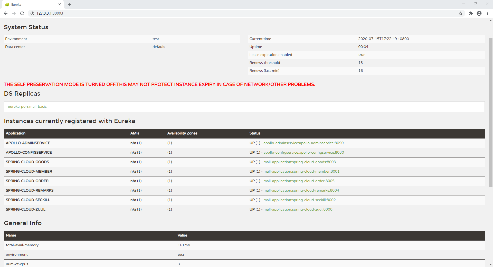
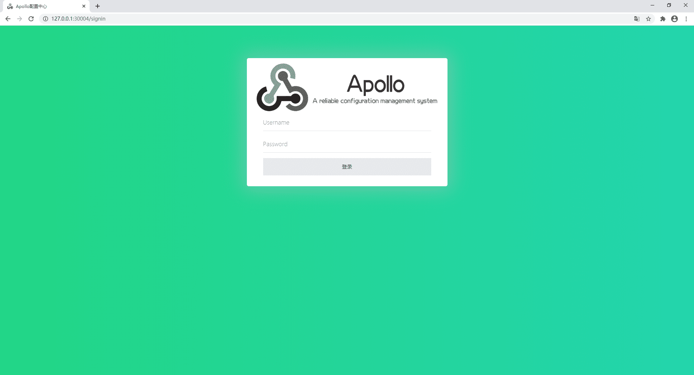
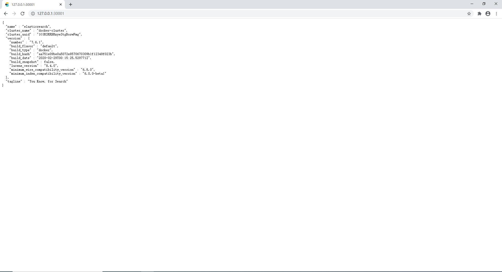
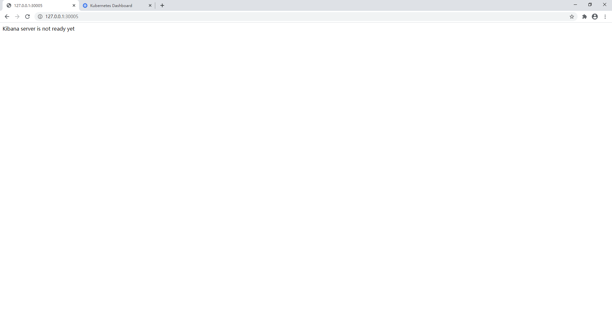
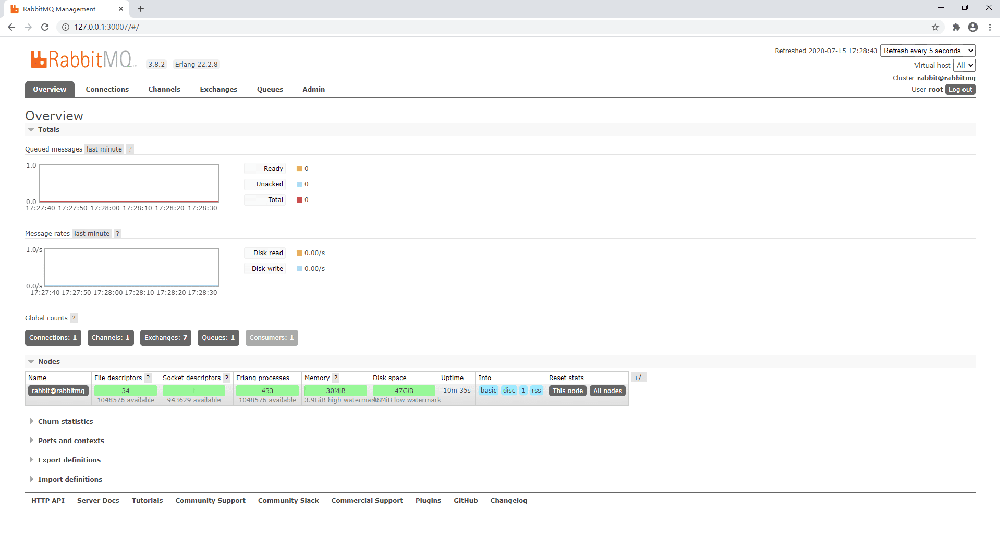
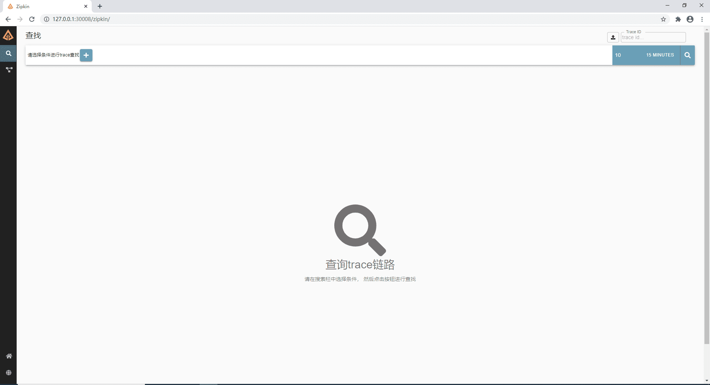
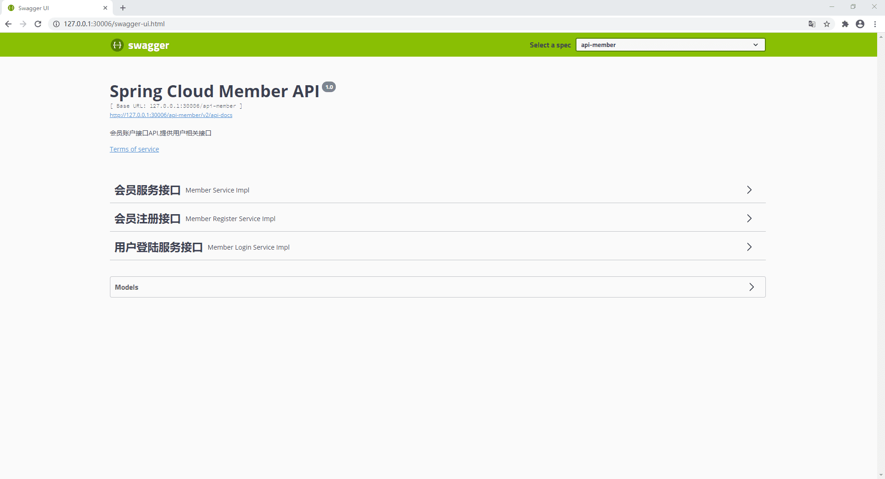
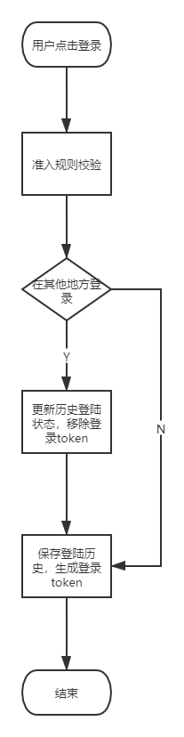

# Mall-server
(目前短信接口已过期，可能存在无法发送短信的问题。)

## 预览地址

> swagger: http://106.13.168.81:8000/swagger-ui.html  (硬件条件受限，仅允许了member和goods服务)

## 准备环境

* 准备docker环境  

#单机k8s版本(QuickStart) 
> 为减小分支文件大小，k8s的分支需要的文件请移步我fork的地址： https://github.com/seethefruture/Mall-Vue-1/tree/k8s
* 1.安装好k8s环境  
* 2.执行/Mall-server下的quick-start.sh脚本  
* 3.npm run dev 启动前端项目  
* 4.等待项目启动完成  

##页面展示
### eureka

### apollo

### elasticsearch

### kibana

### rabbitmq

### zipkin

### 项目swagger

#docker版本(低配分布式推荐)
[docker安装配置教程]()
>首先安装配置完docker

* 1.准备mysql  
>使用docker镜像pull mysql:5.7,下面是执行指令 (当然你也可以使用自己的mysql) 
>1.**docker pull mysql:5.7** 
>2.**docker run -d -p 3306:3306 --name mysql  -e MYSQL_ROOT_PASSWORD=root mysql:5.7** 
>在mysql中导入需要的sql文件(在/sql目录下)共6个sql文件。数据库统一采用innodb，utf-8mbf字符集

* 2.准备redis  
>使用docker镜像pull redis,下面是执行指令 (当然你也可以使用自己的redis) 
>1.**docker pull redis:6.0.5** 
>2.**docker run -d --name redis -p 6379:6379 redis:6.0.5** 

* 3.准备rabbitmq  
>使用docker镜像pull rabbitmq,下面是执行指令 (当然你也可以使用自己的rabbitmq) 
>1.**docker pull rabbitmq:3.8.2-management** 
>2.**docker run -d --name rabbitmq -p 5672:5672 -p 15672:15672 -e RABBITMQ_DEFAULT_USER=root -e RABBITMQ_DEFAULT_PASS=root rabbitmq:3.8.2-management** 

* 4.准备elasticsearch  
>使用docker镜像pull elasticsearch,下面是执行指令 (当然你也可以使用自己的elasticsearch) 
>1.**docker pull elasticsearch:7.6.1** 
>2.**docker run -d --name elasticsearch -e discovery.type=single-node -p 9200:9200 -p 9300:9300 elasticsearch:7.6.1** 
>3.增加/elasticsearch下的index到elasticsearch

* 5.准备kibana  
>使用docker buile dockfile(在/kibana目录下，当然你也可以使用自己的kibana，只需修改配置文件) 
>1.进入kabana目录 
>2.**docker build -t mall-kibana:0.1 .** 
>3.**docker run -d --name kibana -p 5601:5601 mall-kibana:0.1** 

* 6.准备logstash  
>使用docker buile dockfile(在/logstash目录下，当然你也可以使用自己的logstash，只需修改配置文件) 
>1.进入logstash目录 
>2.**docker build -t mall-logstash:0.1 .** 
>3.**docker run -d --name logstash mall-logstash:0.1** 

* 7.准备apollo  
>使用docker-compose up(在/apollo目录下，当然你也可以使用自己的apollo) 
>1.进入apollo目录 
>2.**docker-compose up** 
>3.导入项目配置（在/config目录下） 

* 8.准备zipkin  
>使用docker镜像pull zipkin,下面是执行指令 (当然你也可以使用自己的zipkin) 
>1.**docker pull openzipkin/zipkin** 
>2.**docker run -d --name zipkin -p 9411:9411 openzipkin/zipkin** 
>3.登陆zipkin管理页面 http://127.0.0.1:9411

* 9.启动项目各个模块  
>enjoy!

***注意看logs确保每个组件正确启动运行！***

## 使用组件介绍
* Eureka 注册中心
* Apollo 配置中心
* OpenFeign REST服务调用
* Hystrix 限流熔断
* Zuul 服务接口网关
* Zipkin 服务调用链路追踪
## 项目目录介绍
* springcloud-example-common  
`项目公用模块`
    * springcloud-example-handler  
    `项目公用异常处理模块，待完善`
    * springcloud-example-common  
    `项目公用util`
* springcloud-example-basic  
`微服务基础设施模块`
    * springcloud-example-zuul  
    `项目网关模块`
* springcloud-example-entity  
`项目实体类模块（DO,TOD等）`
* springcloud-example-service-api  
`微服务接口api模块（member,goods,order,remark,seckill等）`
* springcloud-example-service-imp  
`微服务接口实现模块（member,goods,order,remark,seckill等）`

## 主要逻辑
### member模块

在用户进行注册时，首先需要对手机号进行验证，程序会生成有一定时效的token并向用户发送验证码短信，用户在
收到短信验证码后填写验证码，程序此时会返回一个准入注册的token，此时用户填写注册信息，并携带准入token。
程序会核实准入token和当前正在注册手机号，正确无误后会生成并存储用户的账号信息。
具体实现在`com.example.member.api.MemberRegisterServiceImpl`中 
 

用户在登陆时，首先校验准入规则，如登陆设备类型，密码是否匹配，账号是否被禁用等，通过检验后，检查该账号
是否在相同设备多次登录，如果在相同台设备上有处于在线状态的记录，则将此登陆状态设为无效，并移除它的登录
授权令牌，最后保存本次的登陆信息并生成新的授权令牌。
具体实现在`com.example.member.api.MemberLoginServiceImpl`中 

## DDD重构
近期可能会将项目进行小规模重构，采用DDD的思想，也是对DDD的一次初探  
[为什么要重构](https://github.com/PowerDos/Mall-Vue/blob/forMallServerSpringBoot/Mall-server/DDD/DDD_1.md) 
[领域建模](https://github.com/PowerDos/Mall-Vue/blob/forMallServerSpringBoot/Mall-server/DDD/DDD_2.md) 
// TODO
