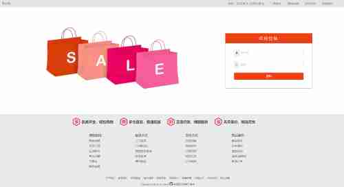
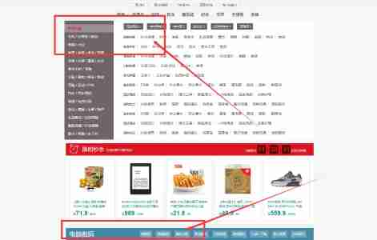
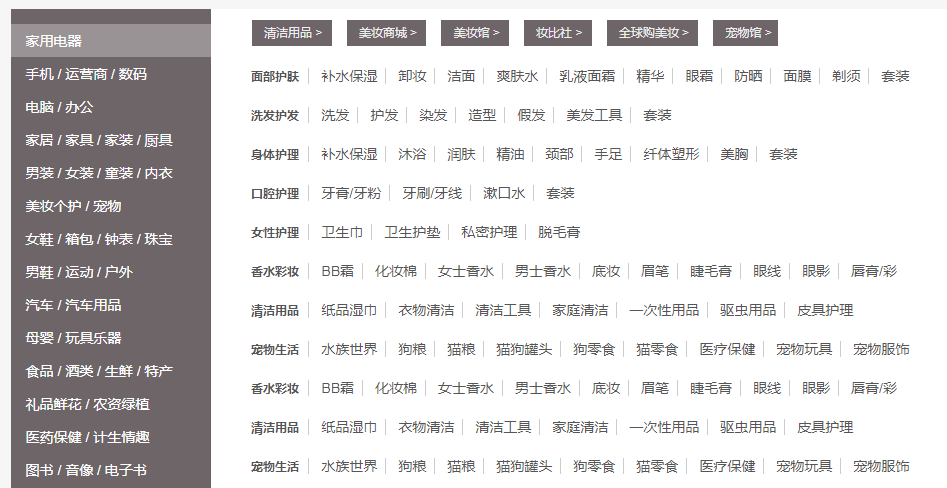
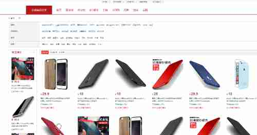
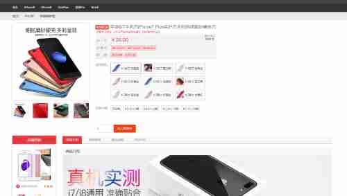
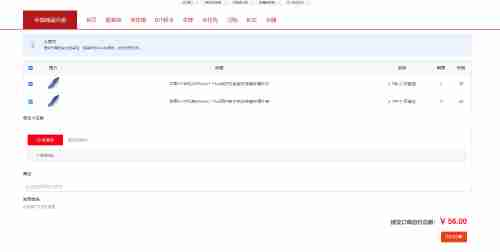

# 本期需求 V0.1
 
### 用户
* 用户可以使用手机号注册账号和登录； 
 
    + 功能说明
        - 使用手机号注册并登录
        - 同一账号仅允许在同一平台(Android,IOS,WEB)登录一个账号
    + 后期规划
        - 流量统计
    + 详细说明
        - 注册流程：用户输入手机号(核验通过)后点击发送短信验证码，接着输入收到的验证码后校验是否匹配，匹配后要求用户填写账号信息(用户名，邮箱，密码)，点击注册创建用户
        - 单一登录：同一个账号仅允许在同一个平台登陆一次，例如用户在PC-WEB登录了账号，接着又在另一处PC-WEB登录了账号，则前一次登录的账号需要强制下线，并提示："您的账号于XXXX-XX-XX XX:XX:XX在异地登陆了平台(ip:XXX:XXX:XXX:XXX)"
        - 退出登录：在当前系统退出当前帐号
### 商品
* 用户可以浏览各种商品(即使是未登陆状态)，商品主页根据商品层级分类展示商品(如：家用电器，手机/运营商/数码...) 
 
    + 功能说明
        - 在商品分类分层中获取商品类别(点击进入商品类别页面)
    + 后期规划
        - 商品搜索功能
        - 搜索框下的标签卡
        - 商品子栏目（如：电脑数码）
    + 详细说明
        - 商品分类：在首页显示出所有的最**顶层**商品类别（例如家用电器，服饰），在鼠标移动到该类别时，在新跳出的类别面板最左侧使用黑体字表明最顶层商品类别的下一级类别（例如鼠标移动至家用电器，黑体字显示冰箱，空调等）**二级**，
        对于每一个黑体字表示的内容，在其右侧展示其子级类别**三级**。只有三级类别可以被点击进入，点击进入查看对应的类别的商品 
        例如： 
        此时则表明：所有商品有顶级分类：家用电器等，而家用电器下有“面部护肤”，“洗发护发”等（尽管这看起来并不合理），而“面部护肤”下面有“补水保湿”，“卸妆”等
        
* 点击商品的分类进入商品分类列表； 
 
    + 功能说明
        - 加载该分类的所有商品(不限店铺)，同时可以按规格型号进一步筛选商品
    + 后期规划
        - 猜你喜欢(推荐功能)
        - 广告
    + 详细说明
        - 商品分类：进入该页面可以加载所有同属于一个商品分类的所有商品，达到页面尾部时触发加载一次商品信息，一次加载20(可更改)条
        - 筛选：可以根据规格型号筛选商品
        - 排序：可以根据综合，评论数，价格等对商品进行排序
* 点具体商品展示商品详情(图片，参数，评论等)和店铺信息； 
 
    + 功能说明
        - 获取商品的详细信息等
    + 后期规划
        - 获取商品所在店铺的一些推荐商品
    + 详细说明
        - 获取商品详情：获取商品图片，规格参数，评价等，根据选择不同商品规格型号展示不同价格。

### 订单
* 用户在登陆后可以选择商品创建订单和对订单进行付款； 
 
    + 功能说明
        - 对购物车中的商品选择性付款
    + 后期规划
        - 地址和物流功能等
        - 订单状态的流转
        - 实际支付流程