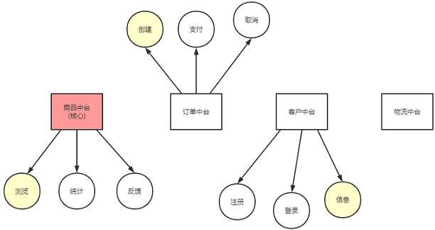

## 需求分析
首先简单概括一下本期的需求：
- 功能需求：用户账号注册登录，浏览商品和下单。
- 扩展性要求：后期可能会有统计，付款，秒杀等功能加入。
- 性能要求：这个目前我们并没有有特殊要求，我们需要预留出可横向和纵向的扩展空间，用于满足性能要求。目前仅能按照需求内容做出预估。
- 其他要求：作为开源项目，我们可能需要使得项目更容易上手，耦合度更底，使得合作者能够更低代价的做出贡献。

## 中台划分
首先作为预采用微服务架构的电商企业，其业务已经是较为成熟的，一般都会包含：商品，客户，订单(支付)等，可能还会有些包含物流业务。 
如何来划分中台？ 
首先需要考虑到企业自身的业务竞争力何在，我们这里就将商品和订单作为我们的核心业务(简单来说就是这个业务最能体现我们企业跟别的企业不同的地方)，而客户作为通用业务(每个企业都有但又不是特别核心的业务)。 
于是我们将系统划分为：
- 商品(核心中台)
- 订单(支撑中台)
- 客户(通用中台)
- 物流(通用中台)

在划分完中台之后，我们就明确了开发重点：商品和订单。

为了能够更好更方便的进行领域对象的提取，我们尝试对各个中台进行子域的划分。
## 子域划分
### 商品中台
那么接下来改如何划分子域？首先我们选择商品作为核心(这个取决于具体企业现状)。

接下来先细看商品：

- 商品浏览(核心子域)
   + 用户可以根据首页商品分类层级信息来查看商品
   + 用户可以从首页子栏目查看商品(虽然不在本次规划中)
   + 用户可以从搜索入口搜索到商品
   + 其他的入口(比如订单历史等)
- 商品创建和删除(目前我们并不考虑开发商户端，所以暂时仅采用直接修改数据库方式添加)
- 商品统计(仅作为一个入口提供后期扩展)
   + 热门商品
   + 浏览统计
   + 购买统计
   + ......
- 商品反馈(比如评论等)

那么商品中台中就包含了**浏览**，**统计**和**反馈**，就我们目前规划，商品浏览应该是着重点，因此我们可以将它作为核心子域，而统计，反馈作为非核心子域。
### 订单中台
考虑完了核心中台，我们再来看通用中台。 
我们先看订单：

- 订单创建，即购买商品(核心子域)
- 订单支付
- 订单取消
- ~~订单申诉(我们可能很长时间不会考虑做这个)~~

那么订单就可以分为**创建**，**支付**和**取消**子域。
### 客户中台
客户中台子域划分：
- 客户注册
- 客户登录
- 客户信息(核心子域)
  + 收货地址
  + 历史订单
  + 密码
  + 隐私信息
  + ~~可能的其他功能(虽然目前没有)~~
  
那么客户就可以分为**注册**，**登录**，**信息**子域。  
 
物流中台我们目前不做设计开发。

至此，我们的设计如下： 

## 构建领域模型

### 商品中台
#### 浏览
#### 统计
#### 反馈

### 订单中台
#### 创建
#### 支付
#### 取消

### 客户中台
#### 注册
#### 登录
#### 信息

